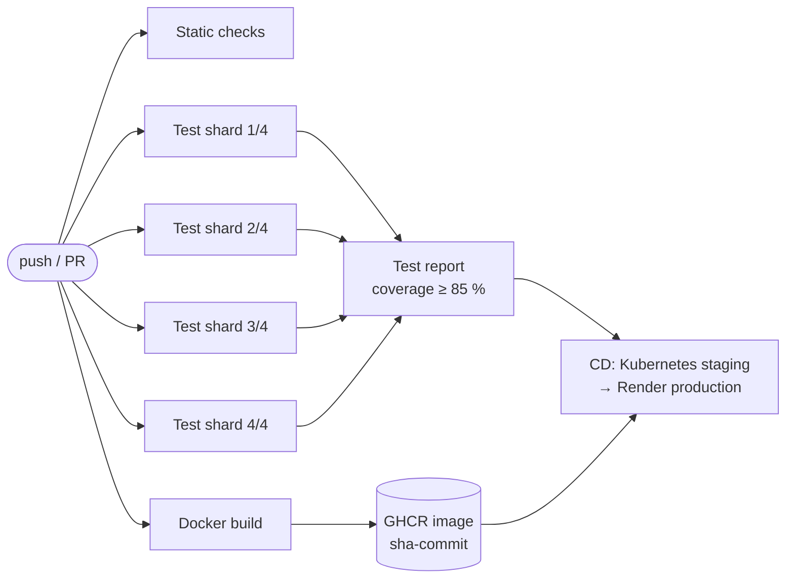

# CI Pipeline Optimization Using Parallel Test Execution and Build Caching

[](https://github.com/AmbujKRai/ci-pipeline-optimization/actions/workflows/ci-optimized.yml)
[](https://github.com/AmbujKRai/ci-pipeline-optimization/actions/workflows/cd.yml)
[](https://github.com/AmbujKRai/ci-pipeline-optimization/actions/workflows/jenkins-verify.yml)
[](https://ambujkrai.github.io/ci-pipeline-optimization/)
[](https://ambujkrai.github.io/ci-pipeline-optimization/coverage/)

A complete DevOps delivery pipeline (Git → build → test → Docker → CI/CD → Kubernetes staging →
production) for **ShopLite**, a small inventory and order management service. We use it to
measure how much **parallel test execution** and **build caching** speed up continuous
integration.

**📊 Results dashboard:** https://ambujkrai.github.io/ci-pipeline-optimization/ (updated after every pipeline run)

## Results in brief

The same work runs under four set-ups: lint, security scan, 581 tests with coverage, Docker build
and container smoke test. Each set-up ran several times on GitHub-hosted runners, and the table
shows median times.

| Pipeline | Wall-clock time | Runner time |
|---|---:|---:|
| Sequential, no cache (baseline) | 2 m 47 s | 2 m 47 s |
| Sequential + caching | 2 m 41 s | 2 m 41 s |
| Parallel, no cache | 1 m 02 s | 3 m 23 s |
| **Parallel + caching (optimized)** | **46 s** | **2 m 33 s** |

- The optimized pipeline is **3.7× faster** than the baseline and still uses **8% less runner
  time**.
- Parallelism gives most of the gain. Caching matters most once work is split across parallel
  jobs, where it saves 27% more.
- More test shards help less and less (Amdahl's law): 4 shards → 46 s, 8 shards → 40 s, at a
  third more compute.
- With the cache-friendly Dockerfile, a rebuild after a code change takes **0.8 s instead of
  6.0 s**, and the image is **184 MB instead of 1.17 GB**.

Full method, tables and discussion: [docs/experiments.md](docs/experiments.md).

## How it works



| Technique | How |
|---|---|
| Parallel jobs | Static checks, test shards and the Docker build start at the same time |
| Test sharding | `pytest-split` balances 4 shards using recorded test durations (`.test_durations`) |
| Parallel workers | `pytest-xdist -n auto --dist worksteal` inside every shard |
| Dependency caching | The whole virtualenv is cached, keyed by OS + Python version + requirements hash |
| Docker layer caching | Layer-ordered multi-stage `Dockerfile` + BuildKit `type=gha` cache |
| Continuous delivery | The exact CI image goes to Kubernetes (kind) staging, then Render; rollback by tag |

## Workflows

| Workflow | Purpose |
|---|---|
| [`ci-optimized.yml`](.github/workflows/ci-optimized.yml) | Main CI for every push and pull request (required checks) |
| [`ci-baseline.yml`](.github/workflows/ci-baseline.yml) | The unoptimized control pipeline |
| [`cd.yml`](.github/workflows/cd.yml) | Staging on Kubernetes → production on Render → promote `latest` |
| [`pipeline-metrics.yml`](.github/workflows/pipeline-metrics.yml) | Collects timings and publishes the dashboard |
| [`docker-cache-benchmark.yml`](.github/workflows/docker-cache-benchmark.yml) | Naive vs optimized Dockerfile experiment |
| [`jenkins-verify.yml`](.github/workflows/jenkins-verify.yml) | Boots the Jenkins setup and runs both Jenkins pipelines |

## Quick start

```bash
python -m venv .venv
# Windows: .venv\Scripts\activate    Linux/macOS: source .venv/bin/activate
pip install -r requirements-dev.txt
python -m app                      # http://localhost:8000, API docs at /docs
pytest -n auto                     # 581 tests on every CPU core
```

With Docker:

```bash
docker compose up --build
```

Without installing Docker, open the repository in **GitHub Codespaces**: the dev container
includes its own Docker engine.

Local Jenkins with both pipelines preconfigured:

```bash
docker compose -f jenkins/docker-compose.yml up -d --build
```

Details: [docs/setup.md](docs/setup.md).

## Repository layout

```
app/                  ShopLite FastAPI service (routers, services, models, templates)
tests/                581 unit, integration and external-service tests
smoke/                post-deployment smoke tests (run against staging and production)
Dockerfile            optimized multi-stage image; docker/Dockerfile.naive is the comparison
k8s/                  Kubernetes manifests for staging
.github/              workflows and the reusable python-env / docker-image actions
Jenkinsfile*          Jenkins versions of the optimized and baseline pipelines
jenkins/              Jenkins image, plugins and Configuration as Code
scripts/              metrics collection, dashboard, experiment and benchmark tools
docs/                 architecture, pipelines, experiments, setup
```

## Documentation

- [Architecture](docs/architecture.md): system, pipelines and application diagrams
- [Pipelines](docs/pipeline.md): every optimization explained, with the YAML that implements it
- [Experiments](docs/experiments.md): methodology, results and threats to validity
- [Setup and operations](docs/setup.md): local run, Docker, Codespaces, Jenkins, Render, rollback

## Team

Ambuj Kumar Rai and Aaryan Sharma, Department of Computer Engineering, K. J. Somaiya School of
Engineering, academic year 2026–27, DevOps mini project.
