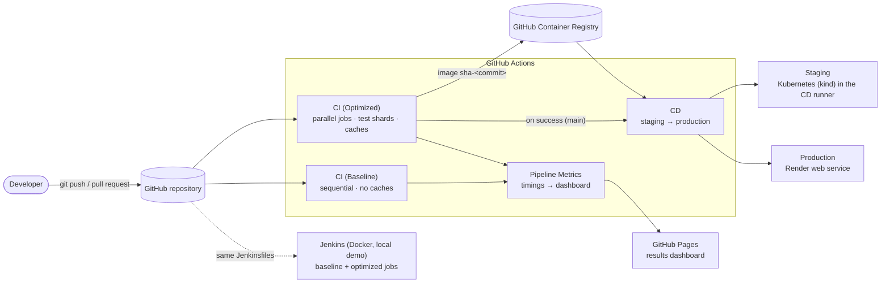
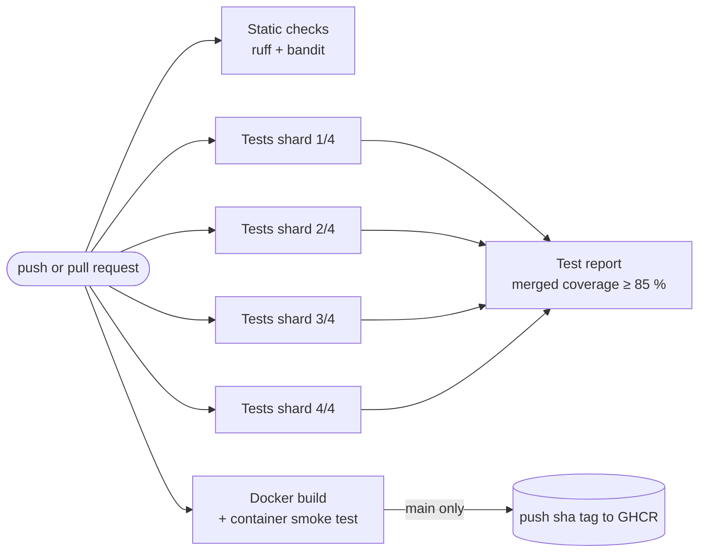
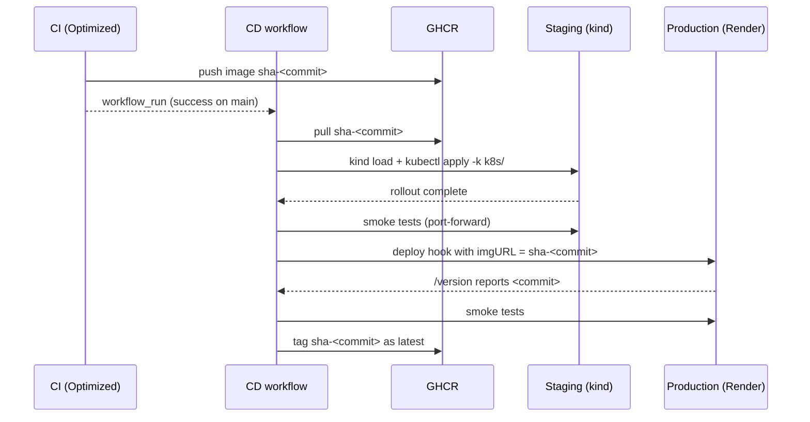
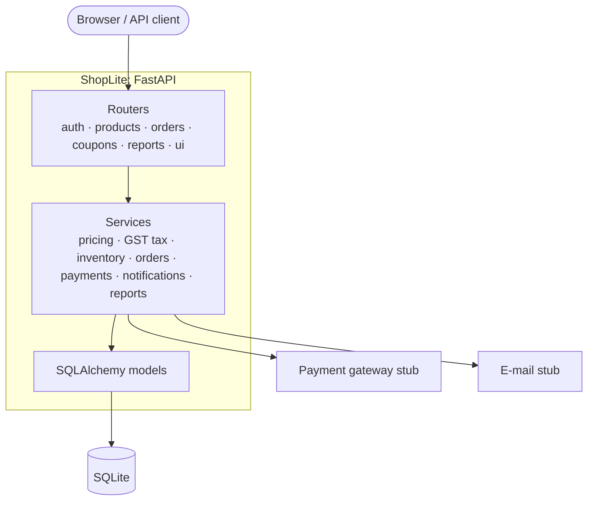

# Architecture

## Delivery pipeline at a glance

| Piece | Tool | Where it runs |
|---|---|---|
| Version control | Git + GitHub (protected `main`, pull requests, required checks) | github.com |
| Build and test | Python 3.12, pytest, pytest-xdist, pytest-split, coverage, ruff, bandit | GitHub-hosted runners |
| Container | Docker (BuildKit), multi-stage `Dockerfile` | GitHub-hosted runners, Codespaces, any Docker host |
| Registry | GitHub Container Registry (`ghcr.io`) | github.com |
| Staging | Kubernetes in Docker (`kind`), manifests in `k8s/` | inside the CD runner (ephemeral) |
| Production | Render free web service running the exact image | render.com |
| Metrics | GitHub REST API → static dashboard | GitHub Pages |
| Second CI server | Jenkins LTS, Configuration as Code | local Docker / Codespaces (verified in CI) |

## Optimized CI pipeline

Every box starts at the same time on its own runner. The pipeline takes as long as its
slowest branch rather than the sum of all of them.

## Continuous delivery

- **Build once, deploy everywhere.** The image that passed CI is the one that runs in
  staging and production; nothing is rebuilt.
- **Immutable tags.** Images are tagged `sha-<commit>`. `latest` only moves after a
  successful deployment.
- **Rollback.** Run the CD workflow by hand with an older tag.

## Application

- **Routers** handle HTTP only. All business rules live in `app/services/`, which is why
  most of the 581 tests are fast unit tests.
- **Money** is stored as integer paise.
- **GST:** CGST + SGST inside Maharashtra, IGST for other states.
- **Payment gateway:** the stub is idempotent per key and supports retries with backoff.
- **Probes:** `/health` serves liveness and readiness checks. `/version` proves which commit
  is deployed.
